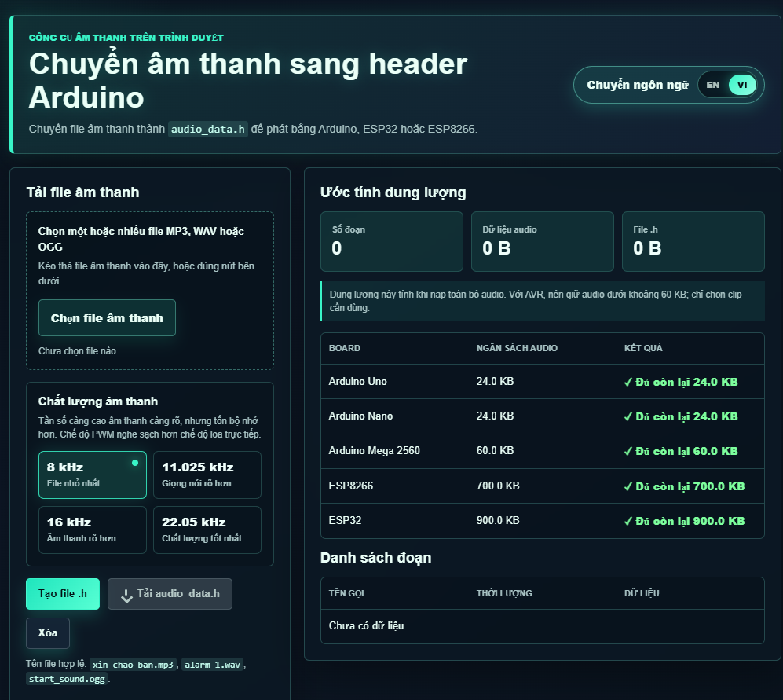
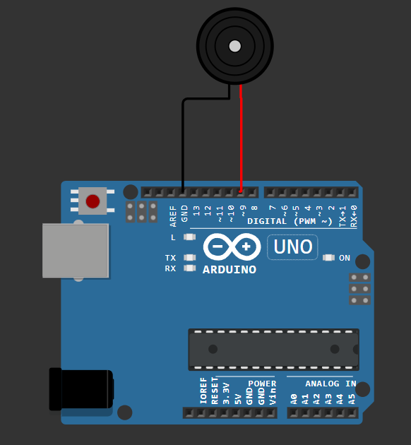
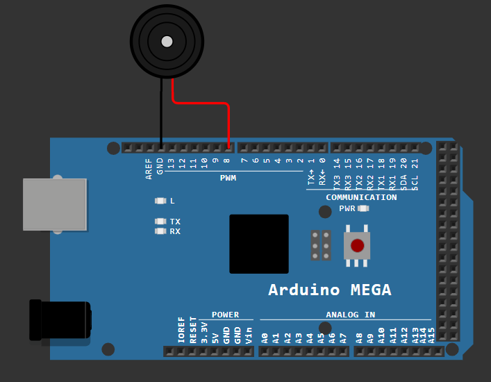
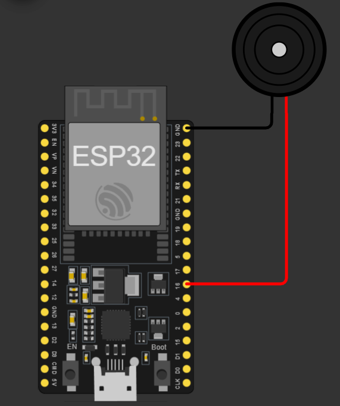

# VN_VOICE

`VN_VOICE` là thư viện phát âm thanh và đọc số tiếng Việt cho Arduino. Thư viện phát dữ liệu âm thanh 8-bit PCM từ file `.h`, hỗ trợ phát theo tên file, phát nối tiếp nhiều âm, chỉnh âm lượng, đọc số nguyên, số thập phân và đọc chuỗi chữ số như số điện thoại.

`VN_VOICE` is an Arduino voice playback library for Vietnamese projects. It plays generated 8-bit PCM audio data from `.h` files, supports named audio clips, queued playback, volume control, Vietnamese integer and decimal number speech, and digit-by-digit reading for phone numbers or ID strings.

Web tạo file âm thanh `.h`: <https://huuphuoc.cloud/vn_voice/>

## Hình Ảnh Minh Họa

Giao diện web tạo file `.h`:



Kết nối mẫu:

| Arduino Uno | Arduino Mega | ESP32 |
|---|---|---|
|  |  |  |

## Tính Năng

- Phát âm thanh tùy chỉnh từ file `audio_data.h` do web tạo ra.
- Gọi âm thanh bằng tên file, ví dụ `playSound("xin_chao", 100)`.
- Chỉ nạp xuống vi điều khiển những âm được chọn bằng `#define TINY_AUDIO_ONLY_ten_am`.
- Tự xếp hàng âm thanh: gọi nhiều lệnh phát liên tiếp thì âm sau chờ âm trước phát xong.
- Chỉnh âm lượng từ `0` đến `100`.
- Đọc số nguyên từ `0` đến `999999999`.
- Đọc số thập phân từ `0.0` đến `999999999.999999`.
- Đọc chuỗi chữ số từ `0` đến `9`, tối đa 20 chữ số mỗi lần gọi.
- Có âm thanh mẫu sẵn để mở examples là chạy thử được ngay.

## Hàm Quan Trọng

Ba hàm thường dùng nhất:

| Hàm | Cần truyền vào | Dùng để làm gì |
|---|---|---|
| `playSound("xin_chao", 100);` | Tên âm thanh, âm lượng | Phát một file âm thanh theo tên trong file `.h` |
| `playNumber(123, 100, 3);` | Số cần đọc, âm lượng, tốc độ đọc | Đọc số nguyên tiếng Việt |
| `playNumber(36.58, 100, 3, 2);` | Số thập phân, âm lượng, tốc độ đọc, số chữ số sau dấu chấm | Đọc số thập phân tiếng Việt |
| `playDigit("0934511069", 100, 3);` | Chuỗi chữ số, âm lượng, tốc độ đọc | Đọc từng chữ số, phù hợp số điện thoại hoặc mã ID |

Ý nghĩa tham số:

- Âm lượng: từ `0` đến `100`.
- Tốc độ đọc: `1` chậm, `2` chậm vừa, `3` bình thường, `4` nhanh.
- Tên âm thanh là tên file không có phần mở rộng. Ví dụ `xin_chao.mp3` thì gọi `playSound("xin_chao", 100);`.

Quy tắc include:

```cpp
#include <VN_VOICE.h>          // Bắt buộc trong mọi chương trình.
#include "audio_data.h"        // Chỉ dùng khi có file .h tự tạo bằng web.
#include <VNVoiceExampleAudio.h> // Chỉ dùng khi muốn chạy âm thanh mẫu.
#include <VNVoiceNumber.h>     // Chỉ dùng khi cần đọc số tiếng Việt.
```

Ngoài `VN_VOICE.h`, header nào không include thì phần dữ liệu/chức năng của header đó không được biên dịch xuống board.

## Board Hỗ Trợ

| Vi điều khiển | Flash dùng | RAM dùng | ĐỌC SỐ | ÂM TÙY CHỈNH |
|---|---:|---:|:---:|:---:|
| ESP32 | 358,662 B, chiếm 27% | 21,408 B, 6% | OK | OK |
| ESP8266 | 284,980 B, chiếm 27% | 28,940 B, 6% | OK | OK |
| Arduino Mega | 54,698 B, chiếm 21% | 833 B, 10% | OK | OK |
| Arduino Nano | 48,588 B, chiếm 158% | 559 B, 27% | NO | OK |
| Arduino Uno | 48,588 B, chiếm 150% | 559 B, 27% | NO | OK |

Lưu ý:

- Bảng trên đo với phần đọc số `VNVoiceNumber.h`. Vì dữ liệu đọc số khá lớn nên Uno/Nano không đủ flash.
- Uno/Nano vẫn phát được âm thanh tùy chỉnh nếu file ngắn. Nên dùng sample rate `8000 Hz`, chỉ chọn đúng clip cần nạp và phát trên chân `9` hoặc `10`.
- Với âm thanh 8-bit PCM, dung lượng xấp xỉ: `8000 Hz = 8000 byte/giây`, `11025 Hz = 11025 byte/giây`, `16000 Hz = 16000 byte/giây`.

## Cài Đặt

1. Tải hoặc copy thư mục thư viện `VN_VOICE`.
2. Đặt thư mục vào thư mục Arduino libraries, ví dụ:

```text
Documents/Arduino/libraries/VN_VOICE
```

3. Mở lại Arduino IDE.
4. Vào `File > Examples > VN_VOICE` để mở ví dụ.


## Tạo File Audio .h

Nếu cần tạo giọng nói từ văn bản, có thể dùng trang TTS miễn phí:

<https://ttsfree.com/vn#try-now>

Trang này cho nhập văn bản tiếng Việt, chọn giọng nam hoặc nữ, điều chỉnh tốc độ và tông giọng. Sau khi tải file âm thanh về, đưa file đó vào web chuyển đổi của `VN_VOICE`.

1. Mở web chuyển đổi: <https://huuphuoc.cloud/vn_voice/>
2. Chọn một hoặc nhiều file âm thanh.
3. Đặt tên file không dấu, không khoảng trắng. Ví dụ:

```text
xin_chao.mp3
nhiet_do.wav
do_am.mp3
```

4. Chọn sample rate.

Sample rate là tần số lấy mẫu âm thanh khi chuyển file audio thành mảng dữ liệu trong file `.h`. Tần số càng cao thì âm thanh càng rõ và giữ được nhiều chi tiết hơn, nhưng kích thước file `.h` cũng tăng lên theo, làm tốn nhiều flash hơn khi nạp vào vi điều khiển.

Ví dụ gần đúng với âm thanh 8-bit PCM:

| Sample rate | Dung lượng ước tính | Chất lượng |
|---:|---:|---|
| 8000 Hz | khoảng 8000 byte/giây | Nhẹ nhất, phù hợp Uno/Nano, đủ cho giọng nói ngắn |
| 11025 Hz | khoảng 11025 byte/giây | Rõ hơn 8000 Hz, phù hợp Mega/ESP hoặc clip ngắn |
| 16000 Hz | khoảng 16000 byte/giây | Rõ hơn nữa, nhưng tốn flash nhiều hơn |

Gợi ý chọn theo board:

| Board | Gợi ý sample rate |
|---|---:|
| Uno/Nano | 8000 Hz |
| Mega | 8000 Hz hoặc 11025 Hz |
| ESP8266/ESP32 | 8000, 11025 hoặc 16000 Hz |

5. Bấm tạo file `.h`.
6. Tải file về và đặt cạnh file `.ino`, thường đặt tên là:

```text
audio_data.h
```

Nếu file âm thanh tên `xin_chao.mp3`, trong code sẽ gọi:

```cpp
playSound("xin_chao", 100);
```

Nếu vừa dùng file `audio_data.h` do web tạo vừa dùng đọc số, include lõi thư viện trước, sau đó include các module cần dùng:

```cpp
#include <VN_VOICE.h>
#include "audio_data.h"
#include <VNVoiceNumber.h>
```

Không cần tự thêm `#include "so_dem.h"` trong file `.ino`.

## Phát Âm Thanh Tùy Chỉnh

Đặt `audio_data.h` cạnh file `.ino`, sau đó include như sau:

```cpp
#define TINY_AUDIO_ONLY_vi_dieu_khien

#include <VN_VOICE.h>
#include "audio_data.h"

const uint8_t SPEAKER_PIN = 9;  // Uno/Nano/Mega: dùng 9 hoặc 10. ESP8266: dùng D5, không ghi số 5.

void setup() {
  TinyAudio.begin(SPEAKER_PIN);
}

void loop() {
  TinyAudio.loop();

  if (!TinyAudio.isPlaying()) {
    playSound("vi_dieu_khien", 100);
    waitAudioDone(2000);
  }
}
```

Nên đặt `#define TINY_AUDIO_ONLY_ten_am` trước `#include "audio_data.h"` để chỉ nạp clip cần dùng. Nếu không khai báo, toàn bộ clip trong file `.h` sẽ được nạp xuống vi điều khiển.

Ví dụ nạp nhiều clip:

```cpp
#define TINY_AUDIO_ONLY_nhiet_do
#define TINY_AUDIO_ONLY_do_c
#define TINY_AUDIO_ONLY_do_am

#include <VN_VOICE.h>
#include "audio_data.h"
```

## Dùng Âm Thanh Mẫu Của Thư Viện

Các ví dụ phát âm thanh mẫu dùng `VNVoiceExampleAudio.h`. Header này chỉ chứa clip mẫu của thư viện, không cần dùng khi chỉ đọc số.

```cpp
#define TINY_AUDIO_ONLY_xin_chao

#include <VN_VOICE.h>
#include <VNVoiceExampleAudio.h>
```

Các clip mẫu hiện có:

```text
do_am: Độ ẩm
do_c: Độ C
nhiet_do: Nhiệt độ
phan_tram: Phần trăm
vi_dieu_khien: Đây là âm thanh từ vi điều khiển
xin_chao: Xin chào
```

## Đọc Số Tiếng Việt

Phần đọc số dùng `VNVoiceNumber.h`. Tính năng này phù hợp Arduino Mega, ESP8266, ESP32 hoặc board lớn hơn. Không dùng đọc số trên Uno/Nano vì dữ liệu giọng đọc số quá lớn.

Nếu chỉ đọc số thì không cần `VNVoiceExampleAudio.h` và không cần file `audio_data.h`.

```cpp
#include <VN_VOICE.h>
#include <VNVoiceNumber.h>

const uint8_t SPEAKER_PIN = 9;  // Mega: dùng 9 hoặc 10. ESP8266: dùng D5. ESP32: dùng 25.

void setup() {
  TinyAudio.begin(SPEAKER_PIN);
}

void loop() {
  TinyAudio.loop();

  if (!TinyAudio.isPlaying()) {
    playNumber(24421, 100, 3);
    waitAudioDone(1000);

    playNumber(36.58, 100, 3, 2);
    waitAudioDone(1000);

    playDigit("0934511069", 100, 3);
    waitAudioDone(3000);
  }
}
```

Tốc độ đọc:

| Mức | Ý nghĩa |
|---:|---|
| 1 | Chậm |
| 2 | Chậm vừa |
| 3 | Bình thường |
| 4 | Nhanh |

## Nút Nhấn Phát Âm Thanh

Nối nút nhấn từ chân `D2` xuống `GND`. Code dùng `INPUT_PULLUP`.

```cpp
#define TINY_AUDIO_ONLY_xin_chao

#include <VN_VOICE.h>
#include <VNVoiceExampleAudio.h>

const uint8_t SPEAKER_PIN = 9;  // Uno/Nano/Mega: dùng 9 hoặc 10. ESP8266: dùng D5.
const uint8_t BUTTON_PIN = 2;   // Arduino Uno/Nano: button on D2 to GND.

bool buttonHandled = false;

void setup() {
  pinMode(BUTTON_PIN, INPUT_PULLUP);
  TinyAudio.begin(SPEAKER_PIN);
}

void loop() {
  TinyAudio.loop();

  if (digitalRead(BUTTON_PIN) == LOW && !buttonHandled) {
    playSound("xin_chao", 100);
    buttonHandled = true;
  }

  if (digitalRead(BUTTON_PIN) == HIGH) {
    buttonHandled = false;
  }
}
```

## Mô Phỏng Cảm Biến Nhiệt Độ

Ví dụ này dùng số random để mô phỏng cảm biến nhiệt độ. Vì có đọc số nên cần Arduino Mega, ESP8266, ESP32 hoặc board lớn hơn.

```cpp
#define TINY_AUDIO_ONLY_nhiet_do
#define TINY_AUDIO_ONLY_do_c

#include <VN_VOICE.h>
#include <VNVoiceNumber.h>
#include <VNVoiceExampleAudio.h>

const uint8_t SPEAKER_PIN = 9;  // Mega: dùng 9 hoặc 10. ESP8266: dùng D5. ESP32: dùng 25.
const uint8_t SENSOR_PIN = A0;  // Arduino Mega: mock analog sensor on A0.

int readMockTemperatureC() {
  return random(24, 38);
}

void setup() {
  randomSeed(analogRead(SENSOR_PIN));
  TinyAudio.begin(SPEAKER_PIN);
}

void loop() {
  TinyAudio.loop();

  if (!TinyAudio.isPlaying()) {
    playSound("nhiet_do", 100);
    waitAudioDone(150);

    playNumber(readMockTemperatureC(), 100, 3);
    waitAudioDone(150);

    playSound("do_c", 100);
    waitAudioDone(5000);
  }
}
```

## API Chính

### Khởi Động Thư Viện

| Hàm | Cần truyền vào | Ý nghĩa |
|---|---|---|
| `TinyAudio.begin(SPEAKER_PIN);` | `SPEAKER_PIN` | Chân GPIO/PWM dùng để phát âm thanh |
| `TinyAudio.begin(SPEAKER_PIN, false, 100);` | `SPEAKER_PIN`, `directSpeakerMode`, `volumePercent` | Chân phát, chế độ phát trực tiếp, âm lượng ban đầu |

Trong đa số trường hợp chỉ cần dùng:

```cpp
TinyAudio.begin(SPEAKER_PIN);
```

### Hàm Luôn Gọi Trong `loop()`

| Hàm | Cần truyền vào | Ý nghĩa |
|---|---|---|
| `TinyAudio.loop();` | Không có | Cập nhật thư viện để phát âm thanh và chạy hàng chờ |

Luôn đặt hàm này trong `loop()`:

```cpp
void loop() {
  TinyAudio.loop();
}
```

### Phát Âm Thanh Theo Tên

| Hàm | Cần truyền vào | Ý nghĩa |
|---|---|---|
| `playSound("xin_chao", 100);` | Tên âm, âm lượng | Phát âm thanh tên `xin_chao` ở âm lượng 100% |
| `TinyAudio.play("xin_chao", 80);` | Tên âm, âm lượng | Giống `playSound`, phát âm lượng 80% |
| `TinyAudio.playOrFirst("xin_chao", 100);` | Tên âm, âm lượng | Nếu không tìm thấy tên thì phát âm đầu tiên |

Vị trí truyền vào:

- Vị trí 1: tên âm thanh, viết trong dấu `"..."`.
- Vị trí 2: âm lượng từ `0` đến `100`.

Ví dụ:

```cpp
playSound("nhiet_do", 100);
playSound("do_c", 80);
```

### Phát Âm Thanh Theo Thứ Tự

| Hàm | Cần truyền vào | Ý nghĩa |
|---|---|---|
| `playSound(0, 100);` | Số thứ tự, âm lượng | Phát clip số 0 trong file `.h` |
| `TinyAudio.play(1, 100);` | Số thứ tự, âm lượng | Phát clip số 1 trong file `.h` |

Nên ưu tiên phát theo tên vì dễ hiểu hơn phát theo số thứ tự.

### Chờ Âm Thanh Phát Xong

| Hàm | Cần truyền vào | Ý nghĩa |
|---|---|---|
| `waitAudioDone();` | Không có | Chờ phát xong toàn bộ âm đang phát |
| `waitAudioDone(1000);` | Thời gian nghỉ thêm | Chờ phát xong, sau đó nghỉ thêm 1000 ms |

Ví dụ phát 2 âm nối tiếp có nghỉ giữa hai âm:

```cpp
playSound("nhiet_do", 100);
waitAudioDone(300);
playSound("do_c", 100);
```

### Đọc Số Nguyên

| Hàm | Cần truyền vào | Ý nghĩa |
|---|---|---|
| `playNumber(123, 100, 3);` | Số cần đọc, âm lượng, tốc độ | Đọc số `123` |

Vị trí truyền vào:

- Vị trí 1: số nguyên cần đọc, từ `0` đến `999999999`.
- Vị trí 2: âm lượng từ `0` đến `100`.
- Vị trí 3: tốc độ đọc từ `1` đến `4`.

### Đọc Số Thập Phân

| Hàm | Cần truyền vào | Ý nghĩa |
|---|---|---|
| `playNumber(36.58, 100, 3, 2);` | Số cần đọc, âm lượng, tốc độ, số chữ số sau dấu chấm | Đọc `ba mươi sáu chấm năm tám` |

Vị trí truyền vào:

- Vị trí 1: số thập phân cần đọc.
- Vị trí 2: âm lượng từ `0` đến `100`.
- Vị trí 3: tốc độ đọc từ `1` đến `4`.
- Vị trí 4: số chữ số sau dấu chấm, tối đa `6`.

### Đọc Từng Chữ Số

| Hàm | Cần truyền vào | Ý nghĩa |
|---|---|---|
| `playDigit("0934511069", 100, 3);` | Chuỗi số, âm lượng, tốc độ | Đọc từng chữ số, phù hợp đọc số điện thoại |

Vị trí truyền vào:

- Vị trí 1: chuỗi chữ số, phải đặt trong dấu `"..."`.
- Vị trí 2: âm lượng từ `0` đến `100`.
- Vị trí 3: tốc độ đọc từ `1` đến `4`.

Giới hạn: chuỗi chỉ gồm ký tự `0` đến `9`, tối đa 20 chữ số.

### Tốc Độ Đọc Số

| Giá trị | Ý nghĩa |
|---:|---|
| `1` | Chậm |
| `2` | Chậm vừa |
| `3` | Bình thường |
| `4` | Nhanh |

### Chỉnh Âm Lượng

| Hàm | Cần truyền vào | Ý nghĩa |
|---|---|---|
| `TinyAudio.setVolume(80);` | Âm lượng | Đặt âm lượng mặc định là 80% |
| `TinyAudio.volume();` | Không có | Trả về âm lượng hiện tại |

### Kiểm Tra Trạng Thái

| Hàm | Cần truyền vào | Ý nghĩa |
|---|---|---|
| `TinyAudio.isPlaying();` | Không có | `true` nếu đang phát âm hoặc còn âm trong hàng chờ |
| `TinyAudio.isSamplePlaying();` | Không có | `true` nếu đang phát trực tiếp một clip |
| `TinyAudio.stop();` | Không có | Dừng phát âm thanh và xóa hàng chờ |

### Hàm Kiểm Tra Lỗi

| Hàm | Cần truyền vào | Ý nghĩa |
|---|---|---|
| `TinyAudio.clipCount();` | Không có | Số clip đang có trong file `.h` |
| `TinyAudio.queueCount();` | Không có | Số âm đang chờ phát |
| `TinyAudio.currentSampleRate();` | Không có | Tần số âm thanh hiện tại |
| `TinyAudio.currentLength();` | Không có | Độ dài clip hiện tại theo số mẫu |
| `TinyAudio.sampleIndex();` | Không có | Vị trí mẫu âm thanh đang phát |
| `TinyAudio.lastError();` | Không có | Mã lỗi gần nhất |
| `TinyAudio.lastErrorText();` | Không có | Tên lỗi gần nhất |

## Macro Quan Trọng

| Macro | Ý nghĩa |
|---|---|
| `TINY_AUDIO_ONLY_ten_am` | Chỉ nạp clip có tên tương ứng |
| `TINY_AUDIO_QUEUE_SIZE` | Tùy chỉnh độ dài hàng chờ âm thanh |
| `TINY_AUDIO_DEFAULT_SPEAKER_PIN` | Tùy chỉnh chân loa mặc định |

## Lưu Ý Phần Cứng

- Uno/Nano nên dùng chân `9` hoặc `10` để âm thanh PWM rõ hơn. Không nên dùng chân `5` trên Uno/Nano vì âm thanh có thể rất rè.
- Arduino Mega nên dùng chân `9` hoặc `10`; cũng có thể dùng các chân PWM như `2`, `3`, `5`, `6`, `7`, `8`, `44`, `45`, `46`.
- ESP8266 NodeMCU nên dùng `D5/GPIO14`, `D6/GPIO12` hoặc `D7/GPIO13`.
- ESP8266 không nên dùng `D3/GPIO0`, `D4/GPIO2`, `D8/GPIO15` vì đây là các chân liên quan đến boot, có thể làm board không chạy sketch hoặc im tiếng.
- Khi dùng ESP8266, `D5` không giống số `5`: `D5` là GPIO14, còn số `5` là GPIO5/D1.
- ESP32 nên dùng `GPIO25` hoặc `GPIO26`; cũng có thể dùng `GPIO27`, `GPIO32`, `GPIO33`. Không dùng `GPIO34` đến `GPIO39` vì các chân này chỉ đọc vào.
- Chất lượng âm thanh phụ thuộc rất nhiều vào chất lượng loa, mạch khuếch đại, nguồn cấp và lọc nhiễu.
- Loa có điện trở thấp hoặc công suất lớn không thể cấp trực tiếp từ chân GPIO của vi điều khiển. Nên dùng mạch khuếch đại âm thanh phù hợp.
- Phát trực tiếp qua loa thụ động từ GPIO có thể nghe được với loa nhỏ, nhưng âm thường nhỏ, méo hoặc rè nếu tải quá nặng.
- Tần số chuyển đổi như `8000 Hz`, `11025 Hz`, `16000 Hz` chỉ là một phần của chất lượng âm thanh. Phần cứng loa, công suất ampli, dây nối, nguồn và mạch lọc nhiễu ảnh hưởng rất lớn tới độ rõ.
- Nếu dùng mạch khuếch đại và nghe tiếng rít cao tần, nên thêm mạch lọc RC ở đầu ra PWM hoặc dùng module khuếch đại có lọc đầu vào tốt hơn.
- Nếu loa nóng, âm rè mạnh hoặc board reset, hãy ngắt nguồn và kiểm tra lại tải loa, mạch khuếch đại và cách cấp nguồn.

## Tips Giảm Dung Lượng

- Chỉ nạp clip cần dùng bằng `#define TINY_AUDIO_ONLY_ten_am`.
- Với Uno/Nano, chọn `8000 Hz`.
- Cắt im lặng ở đầu và cuối file âm thanh trước khi tạo `.h`.
- Dùng tên file ngắn, không dấu, không khoảng trắng.
- Không dùng `VNVoiceNumber.h` trên Uno/Nano vì dữ liệu đọc số quá lớn.

## License

This work is licensed under the Creative Commons Attribution-NonCommercial 4.0 International License. See `LICENSE` for details.
